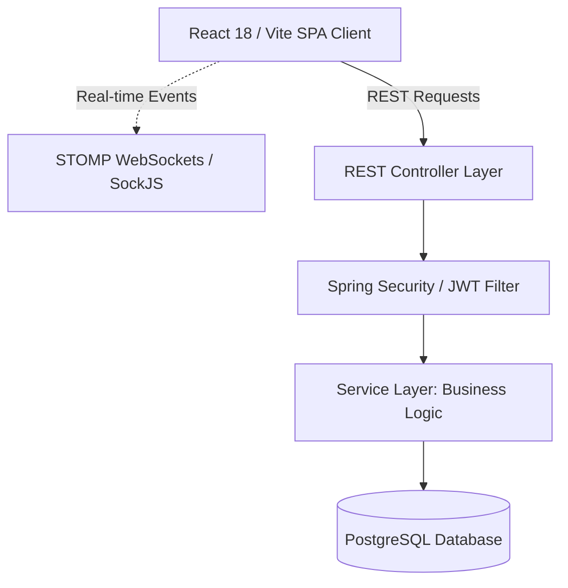

# SIIDS Architectural Intelligence Report
**Strategic Intelligence & Investigation Division System (SIIDS)**

---

## 1. Executive System Summary

SIIDS (Strategic Intelligence & Investigation Division System) is a specialized full-stack application designed to coordinate Rwanda Revenue Authority (RRA) operations across intelligence collection, surveillance monitoring, case investigation, legal analysis, and physical stock/seizure management.

### Architectural Health Assessment
* **Backend Status**: The Spring Boot 3.5.x application is functional but has high architectural coupling. Business logic is heavily concentrated in bloated "god services" (e.g., `ReportService` is 116KB, `PhysicalStockService` is 38KB), database queries contain hardcoded primary key mappings, and security filters contain temporary bypasses for testing that expose critical APIs.
* **Frontend Status**: The React 18/Vite application utilizes Material UI v7. It operates as a series of role-based dashboards, but the layout is fragmented, navigation structures are rigid, and state management is disorganized (Contexts exist but are bypassed in favor of local component states and raw Axios calls).
* **Overall Assessment**: The system is in a "legacy-transition" state. It functions under optimistic conditions but lacks the resilience, isolation, auditability, and clean separation of concerns required for a production-grade enterprise system.

---

## 2. Current Architecture Overview

SIIDS utilizes a standard three-tier architecture:



### Key Architectural Layers:
1. **Presentation Layer (React 18 / Vite)**: Combines Material UI, Bootstrap, and Styled Components. Grouped by role dashboards under `src/Components/` and `src/Pages/`.
2. **Security Gateway**: Custom `JwtFilter` checks headers and passes authentication tokens to Spring Security’s `SecurityContextHolder`.
3. **API Controller Layer**: RestControllers maps endpoints, parses multipart requests (attachments), and converts domain models via simple mapper helpers.
4. **Service Layer**: House business rules. Operates under `@Transactional` boundaries. Interacts with `PdfService` for document compilation and `WebSocketNotificationService` for events.
5. **Data Access Layer (Spring Data JPA)**: Repositories map queries to PostgreSQL. Relies on JPQL and native SQL queries.

---

## 3. Backend Intelligence Report

### Category 1: Authentication & Authorization
* **Current Implementation Summary**: JWT-based stateless security. Access tokens expire in 8 hours (configured in properties) and refresh tokens in 7 days.
* **Important Files/Classes**: 
  - [SecurityConfig.java](file:///c:/Users/HP/Desktop/RRA/Project%201/NewSiids/Siids/SiidsBackend/src/main/java/org/example/siidsbackend/Config/SecurityConfig.java)
  - [JwtFilter.java](file:///c:/Users/HP/Desktop/RRA/Project%201/NewSiids/Siids/SiidsBackend/src/main/java/org/example/siidsbackend/Config/JwtFilter.java)
  - [JWTService.java](file:///c:/Users/HP/Desktop/RRA/Project%201/NewSiids/Siids/SiidsBackend/src/main/java/org/example/siidsbackend/Service/JWTService.java)
  - [UserPrincipal.java](file:///c:/Users/HP/Desktop/RRA/Project%201/NewSiids/Siids/SiidsBackend/src/main/java/org/example/siidsbackend/Model/UserPrincipal.java)
* **Strengths**: Token refresh endpoint (`/api/auth/refresh`) is implemented; tokens contain roles; CORS is explicitly declared.
* **Weaknesses**: 
  - **CRITICAL BYPASS**: `SecurityConfig.java` permits all requests to `/api/stock/**` and `/api/stock/goods/**` to bypass authentication for "debugging 403".
  - **Key Sharing**: Access and refresh tokens are signed using the exact same secret key (`secretKey` variable).
  - **Fragile Authorities**: `UserPrincipal.java` returns three mappings for a single role (`role`, `normalized`, `ROLE_ + normalized`) to prevent authorization matching issues.
* **Missing Enterprise-Grade Features**: Refresh token rotation (RTR), token blacklisting on logout, OAuth2/OIDC provider integration, and rate limiting.
* **Refactor Recommendations**: Re-enable authentication on `/api/stock/**` and configure proper Role-Based Access Control (RBAC) using `@PreAuthorize`. Separate the keys used for signing access and refresh tokens.
* **Priority Level**: **CRITICAL**

### Category 2: API Architecture
* **Current Implementation Summary**: Mix of REST structures and RPC-like endpoints. Endpoint naming is verbose.
* **Important Files/Classes**: 
  - [ReportController.java](file:///c:/Users/HP/Desktop/RRA/Project%201/NewSiids/Siids/SiidsBackend/src/main/java/org/example/siidsbackend/Controller/ReportController.java)
  - [CaseController.java](file:///c:/Users/HP/Desktop/RRA/Project%201/NewSiids/Siids/SiidsBackend/src/main/java/org/example/siidsbackend/Controller/CaseController.java)
* **Strengths**: Good usage of Spring's `ResponseEntity` and HTTP statuses (`200 OK`, `201 Created`, `403 Forbidden`).
* **Weaknesses**:
  - **Brittle Parsing**: `CaseController.java` utilizes request URI substring parsing to find case numbers:
    `requestURI.substring(requestURI.indexOf(caseNumPath) + caseNumPath.length())` instead of `@PathVariable` or `@RequestParam`.
  - **Inconsistent Mappings**: Mismatch between REST actions. Some status changes use POST, others use PATCH, others use PUT.
* **Missing Enterprise-Grade Features**: API Versioning (`/api/v1/`), Swagger/OpenAPI documentation, standardized error envelopes, and standardized pagination query formats.
* **Refactor Recommendations**: Unify path variables across all controllers. Replace manually parsed paths with standard Spring MVC annotations. Unify error shapes.
* **Priority Level**: **HIGH**

### Category 3: Controllers
* **Current Implementation Summary**: Controllers act as business logic coordinators. `ReportController` is excessively bloated (1704 lines, 81KB).
* **Important Files/Classes**:
  - [ReportController.java](file:///c:/Users/HP/Desktop/RRA/Project%201/NewSiids/Siids/SiidsBackend/src/main/java/org/example/siidsbackend/Controller/ReportController.java)
* **Strengths**: Implements path-traversal check logic on files and validates file magic numbers before processing.
* **Weaknesses**:
  - **Leaked Business Decisions**: Controllers make direct checks against database repositories to verify user privileges (e.g., checking if a user is in `DirectorsOfInvestigation()` or is an `Admin` directly inside `ReportController` instead of delegating to a security context or service).
  - **Bloated File Handling**: Multipart copying, validation of headers, and file copying are written directly inside the controller body.
* **Missing Enterprise-Grade Features**: Dedicated file storage service abstractions (e.g., MinIO or S3 wrappers) and controller advice mappings.
* **Refactor Recommendations**: Extract file validation and writing logic to a dedicated `StorageService`. Relocate access control evaluations to service methods or Spring Security expressions.
* **Priority Level**: **HIGH**

### Category 4: Services
* **Current Implementation Summary**: Services handle transactional steps. `ReportService` is a monolithic service containing 2505 lines (116KB) of code.
* **Important Files/Classes**:
  - [ReportService.java](file:///c:/Users/HP/Desktop/RRA/Project%201/NewSiids/Siids/SiidsBackend/src/main/java/org/example/siidsbackend/Service/ReportService.java)
  - [PhysicalStockService.java](file:///c:/Users/HP/Desktop/RRA/Project%201/NewSiids/Siids/SiidsBackend/src/main/java/org/example/siidsbackend/Service/PhysicalStockService.java)
* **Strengths**: Fully leverages Spring `@Transactional` to guarantee database consistency during complex multi-step status transitions.
* **Weaknesses**:
  - **Procedural Workflows**: Transitions are managed via nested `switch` blocks evaluating the state string.
  - **God Classes**: `ReportService` coordinates intelligence reports, case plans, investigation reports, legal reviews, and reward memo workflows.
* **Missing Enterprise-Grade Features**: Decoupled state machine (e.g., Spring State Machine or State Pattern) and Event-Driven architecture (publishing ApplicationEvents instead of calling notification services inline).
* **Refactor Recommendations**: Divide `ReportService` into separate domain services: `IntelligenceReportService`, `InvestigationService`, `RewardMemoService`, and `CasePlanService`.
* **Priority Level**: **HIGH**

### Category 5: Entities / Models
* **Current Implementation Summary**: Standard JPA entities mapping directly to database tables. Relationships are declared using `@ManyToOne` and `@OneToOne` annotations.
* **Important Files/Classes**:
  - [Report.java](file:///c:/Users/HP/Desktop/RRA/Project%201/NewSiids/Siids/SiidsBackend/src/main/java/org/example/siidsbackend/Model/Report.java)
  - [Case.java](file:///c:/Users/HP/Desktop/RRA/Project%201/NewSiids/Siids/SiidsBackend/src/main/java/org/example/siidsbackend/Model/Case.java)
  - [SeizureNote.java](file:///c:/Users/HP/Desktop/RRA/Project%201/NewSiids/Siids/SiidsBackend/src/main/java/org/example/siidsbackend/Model/SeizureNote.java)
* **Strengths**: Clean entity structures with proper bidirectional relation references.
* **Weaknesses**:
  - **God Entity**: `Report.java` contains fields for four distinct stages: initial description, case plan, findings, recommendations, and reward parameters.
  - **Missing Status Property**: `Report.java` does not contain its own `status` column; its `getStatus()` method delegates to `relatedCase.getStatus()`. This prevents a single case from containing multiple reports with separate statuses.
* **Missing Enterprise-Grade Features**: Proper database auditing columns (`@CreatedDate`, `@LastModifiedBy`), database-level history tables, and composite value objects.
* **Refactor Recommendations**: Deconstruct `Report` into separate domain tables: `IntelligenceReport`, `CasePlan`, and `InvestigationReport`. Add independent status fields.
* **Priority Level**: **HIGH**

### Category 6: DTOs / Mappers
* **Current Implementation Summary**: Basic DTO usage for request and response structures. In many cases, controllers expose raw JPA entities to the network.
* **Important Files/Classes**:
  - [ReportResponseDTO.java](file:///c:/Users/HP/Desktop/RRA/Project%201/NewSiids/Siids/SiidsBackend/src/main/java/org/example/siidsbackend/DTO/Response/ReportResponseDTO.java)
* **Strengths**: Exposes derived values like `canSubmitFindings` and `canSubmitCasePlan` directly as booleans to simplify frontend logic.
* **Weaknesses**: Exposing raw entities like `Case` inside DTO structures. Manual mapping code is written directly inside the service.
* **Missing Enterprise-Grade Features**: Automatic mapper layers (MapStruct) and schema separation.
* **Refactor Recommendations**: Introduce MapStruct. Ensure no database entity is ever exposed directly to/from REST endpoints.
* **Priority Level**: **MEDIUM**

### Category 7: Repositories
* **Current Implementation Summary**: Repositories extend `JpaRepository` and define custom JPQL and native SQL queries.
* **Important Files/Classes**:
  - [ReportRepo.java](file:///c:/Users/HP/Desktop/RRA/Project%201/NewSiids/Siids/SiidsBackend/src/main/java/org/example/siidsbackend/Repository/ReportRepo.java)
* **Strengths**: Good usage of JPA relations to pull nested data.
* **Weaknesses**:
  - **HARDCODED DATA IDs**: In `ReportRepo.java`, queries select actors using hardcoded structure/job master primary key IDs:
    `j.job_master_id = 119 and j.grade_id = 5` (for Director of Intelligence, line 88)
    `j.job_master_id = 116 and j.grade_id = 4` (for Assistant Commissioner, line 110)
    This is extremely fragile and will fail if IDs change across environments.
* **Missing Enterprise-Grade Features**: QueryDSL or Criteria API for dynamic filtering, and soft-deletes implementation.
* **Refactor Recommendations**: Remove hardcoded integers. Query roles dynamically by checking the role code or authority mapping tables.
* **Priority Level**: **CRITICAL**

### Category 8: Validation & Exception Handling
* **Current Implementation Summary**: Basic check loops in service methods and manual file header validation in controllers.
* **Important Files/Classes**:
  - [ReportController.java](file:///c:/Users/HP/Desktop/RRA/Project%201/NewSiids/Siids/SiidsBackend/src/main/java/org/example/siidsbackend/Controller/ReportController.java)
* **Strengths**: Good binary checking of `%PDF` and JPEG/PNG headers to block fake extensions.
* **Weaknesses**:
  - **No Global Handler**: Lacks a unified `@ControllerAdvice` to catch exceptions. Errors are handled in massive try-catch blocks in each controller method.
  - **Validation Duplication**: Validation logic is repeated across creation and editing endpoints.
* **Missing Enterprise-Grade Features**: Jakarta Bean Validation (`@Valid`, `@NotNull`, `@Size`) and standard RFC 7807 problem details response.
* **Refactor Recommendations**: Add a `GlobalExceptionHandler` mapping standard Spring MVC exceptions. Replace manual string validations with Java Bean annotations.
* **Priority Level**: **HIGH**

### Category 9: Security & Auditing
* **Current Implementation Summary**: Basic `AuditService` writing actions into an `AuditLog` table.
* **Important Files/Classes**:
  - [AuditService.java](file:///c:/Users/HP/Desktop/RRA/Project%201/NewSiids/Siids/SiidsBackend/src/main/java/org/example/siidsbackend/Service/AuditService.java)
  - [AuditLog.java](file:///c:/Users/HP/Desktop/RRA/Project%201/NewSiids/Siids/SiidsBackend/src/main/java/org/example/siidsbackend/Model/AuditLog.java)
* **Strengths**: Action logging occurs automatically in key transactional paths.
* **Weaknesses**:
  - **Loose Signatures**: Seizure note signatures are recorded simply as a string stating `"Digital Signature verified via Password"`.
  - **Auditable Scopes**: Not all state transitions are consistently written to the audit log.
* **Missing Enterprise-Grade Features**: Hibernate Envers for entity-level version tracking, IP address tracking, and cryptographic signature auditing.
* **Refactor Recommendations**: Integrate Hibernate Envers. Record IP address and user agent in the audit schema.
* **Priority Level**: **MEDIUM**

### Category 10: Notifications & Real-Time Features
* **Current Implementation Summary**: WebSocket implementation using STOMP and SockJS. Pushes notifications to specific users and broadcast queues.
* **Important Files/Classes**:
  - [WebSocketConfig.java](file:///c:/Users/HP/Desktop/RRA/Project%201/NewSiids/Siids/SiidsBackend/src/main/java/org/example/siidsbackend/Config/WebSocketConfig.java)
  - [WebSocketNotificationService.java](file:///c:/Users/HP/Desktop/RRA/Project%201/NewSiids/Siids/SiidsBackend/src/main/java/org/example/siidsbackend/Service/WebSocketNotificationService.java)
* **Strengths**: Real-time push logic works dynamically; saves notifications to the database so users see past alerts upon reconnecting.
* **Weaknesses**:
  - **Scalability Limitation**: Uses the default in-memory STOMP broker. This will fail to sync notifications across instances in a clustered/load-balanced server environment.
* **Missing Enterprise-Grade Features**: External broker integration (RabbitMQ/ActiveMQ) and notification prioritization.
* **Refactor Recommendations**: Configure Spring WebSockets to use an external message broker (RabbitMQ) for clustering readiness.
* **Priority Level**: **MEDIUM**

### Category 11: Performance & Scalability
* **Current Implementation Summary**: Classic JPA-SQL flow. Database operations execute on the main thread pool.
* **Important Files/Classes**:
  - [ReportService.java](file:///c:/Users/HP/Desktop/RRA/Project%201/NewSiids/Siids/SiidsBackend/src/main/java/org/example/siidsbackend/Service/ReportService.java)
* **Strengths**: Database-first joins keep simple lookups fast.
* **Weaknesses**:
  - **PDF compilation**: Compiling PDF documents happens synchronously during API calls.
  - **N+1 queries**: Fetching reports triggers multiple relational queries to fetch the nested case, taxpayer, and employee objects.
* **Missing Enterprise-Grade Features**: Caching layer (Redis), asynchronous task execution (using `@Async` for PDF compilation), and database read-write splits.
* **Refactor Recommendations**: Move PDF compilation, email sending, and notification broadcasts to background threads. Add `@EntityGraph` mappings to prevent N+1 queries.
* **Priority Level**: **MEDIUM**

---

## 4. Frontend Intelligence Report

### Category 1: Routing & Navigation
* **Current Implementation Summary**: Uses React Router v7 with a `ProtectedRoute` wrapper component and an `AppShell` layout.
* **Important Files/Components**:
  - [App.jsx](file:///c:/Users/HP/Desktop/RRA/Project%201/NewSiids/Siids/siidsfrontend/src/App.jsx)
  - [SideNav.jsx](file:///c:/Users/HP/Desktop/RRA/Project%201/NewSiids/Siids/siidsfrontend/src/Components/SideNav.jsx)
* **Strengths**: Strict client-side route checking before mounting pages.
* **Weaknesses**:
  - **Commented Out Sections**: The sidebar menu sections are manually commented out, and sections like "Intelligence" are grouped under "Surveillance" in the navigation drawer, creating layout confusion.
* **Missing Enterprise-Grade Features**: Dynamic sidebar configuration fetched from the user permission endpoint and breadcrumbs.
* **Redesign Recommendations**: Create a clean navigation mapping system. Un-comment the sections and separate "Intelligence" dashboards from "Surveillance" dashboards.
* **Priority Level**: **HIGH**

### Category 2: Authentication Flow
* **Current Implementation Summary**: Authentication context managing state, using `localStorage` and `sessionStorage` for persistence.
* **Important Files/Components**:
  - [AuthContext.jsx](file:///c:/Users/HP/Desktop/RRA/Project%201/NewSiids/Siids/siidsfrontend/src/context/AuthContext.jsx)
  - [Login.jsx](file:///c:/Users/HP/Desktop/RRA/Project%201/NewSiids/Siids/siidsfrontend/src/Components/Login.jsx)
* **Strengths**: Context-aware token refresh logic is integrated inside Axios interceptors.
* **Weaknesses**:
  - **Wiping Storage**: The logout function calls `localStorage.clear()` and `sessionStorage.clear()`. This completely wipes any unrelated keys stored on the same origin.
* **Missing Enterprise-Grade Features**: Security mechanisms to prevent session hijacking (e.g., keeping tokens in memory and using HttpOnly cookies).
* **Redesign Recommendations**: Change logout to remove only the key-value pairs associated with the SIIDS session (e.g., `removeItem('token')`).
* **Priority Level**: **HIGH**

### Category 3: Dashboards by User Role

#### Intelligence & Investigation Module

```text
Dashboard Grouping:
├── Intelligence Officer Dashboard
├── Director of Intelligence Dashboard
├── Assistant Commissioner Dashboard
├── Investigation Officer Dashboard
├── Director of Investigation Dashboard
└── Legal Advisor Dashboard
```

* **Intelligence Officer Dashboard**:
  - *Current Features*: View case lists, submit new reports, search and filter tables, and export case categories to Excel sheets.
  - *Missing Enterprise Features*: Inline status timelines, collaborative commenting threads, and draft auto-saving.
  - *UX Weaknesses*: Visual noise due to large data tables, lack of visual filters, and manual entry of TIN details.
  - *Enhancement Opportunities*: Integrate dynamic tax-system auto-lookup (e.g., checking Rwanda's ETAX/EBM records).
* **Director of Intelligence Dashboard**:
  - *Current Features*: Approve intelligence reports, reject cases, or return them with a feedback reason.
  - *Missing Enterprise Features*: Bulk approval buttons and workload metrics comparison charts.
  - *UX Weaknesses*: Long scroll lists to read reports, no quick-preview card models.
  - *Enhancement Opportunities*: Add a split-pane review layout for quick comparisons.
* **Assistant Commissioner Dashboard**:
  - *Current Features*: Approve case plans, view case plans sent from directorates, and review penalties/fines reports.
  - *Missing Enterprise Features*: Real-time financial dashboards summarizing tax evaded vs. tax recovered.
  - *UX Weaknesses*: Financial analytics are presented as raw lists with no graphs.
  - *Enhancement Opportunities*: Add interactive charts mapping case statuses and cash recovery statistics.
* **Investigation Officer Dashboard**:
  - *Current Features*: Accept assigned cases, draft case plans, upload investigation findings, and input tax penalty values.
  - *Missing Enterprise Features*: Evidence attachment categorizations (e.g., physical vs. document records) and field task lists.
  - *UX Weaknesses*: Massive multi-field forms that lack wizard layouts.
  - *Enhancement Opportunities*: Implement a multi-step stepper wizard for compiling investigation findings.
* **Director of Investigation Dashboard**:
  - *Current Features*: Assign cases to investigation officers and approve case plans.
  - *Missing Enterprise Features*: Auto-assignment algorithms based on officer workload.
  - *UX Weaknesses*: Workloads are not visible when assigning a case to an officer.
  - *Enhancement Opportunities*: Show officer task volumes next to their name in the assign dropdown.
* **Legal Advisor Dashboard**:
  - *Current Features*: Review investigation reports and return them to the Assistant Commissioner with comments.
  - *Missing Enterprise Features*: Standard legal template document generator.
  - *UX Weaknesses*: Plain-text box for legal review comments with no formatting tools.
  - *Enhancement Opportunities*: Integrate rich-text document editors.

#### Surveillance & Stock Module

```text
Dashboard Grouping:
├── Surveillance Officer Dashboard
├── Stock Manager Dashboard
└── PRSO Dashboard
```

* **Surveillance Officer Dashboard**:
  - *Current Features*: Create surveillance cases, record physical details, and view temporary stock inventories.
  - *Missing Enterprise Features*: Mapping/GIS layout to track smuggling routes and common seizure points.
  - *UX Weaknesses*: Inability to upload photos of seized vehicles or goods directly.
  - *Enhancement Opportunities*: Integrate photo uploads and image previews in the seizure form.
* **Stock Manager Dashboard**:
  - *Current Features*: Verify intake requests, record goods transfers, and submit release requests.
  - *Missing Enterprise Features*: Barcode/QR generator for assets and inventory low-stock alerts.
  - *UX Weaknesses*: Unstructured lists of items under intake review.
  - *Enhancement Opportunities*: Add barcode creation and status timeline visuals.
* **PRSO Dashboard**:
  - *Current Features*: Authorize release requests and review auction history logs.
  - *Missing Enterprise Features*: Direct auction platform integration.
  - *UX Weaknesses*: Simple list view with no highlighting of priority items.
  - *Enhancement Opportunities*: Add high-value item badges and quick-action validation toggles.

### Category 4: Component Architecture
* **Current Implementation Summary**: Monolithic UI components. Many dashboard files are extremely large (e.g., `InvestigationOfficer.jsx` is 99KB, `DirectorInvestigation.jsx` is 89KB).
* **Important Files/Components**:
  - [InvestigationOfficer.jsx](file:///c:/Users/HP%20/Desktop/RRA/Project%201/NewSiids/Siids/siidsfrontend/src/Components/InvestigationOfficer.jsx)
  - [DirectorInvestigation.jsx](file:///c:/Users/HP/Desktop/RRA/Project%201/NewSiids/Siids/siidsfrontend/src/Components/DirectorInvestigation.jsx)
* **Strengths**: Utilizes MUI grid layouts effectively to separate cards and tables.
* **Weaknesses**: Severe code duplication. Search boxes, sort indicators, pagination logic, and data fetch triggers are duplicated across almost all dashboards.
* **Missing Enterprise-Grade Features**: Reusable component library (e.g., `<SiidsTable>`, `<SiidsSearchInput>`, `<AttachmentList>`).
* **Redesign Recommendations**: Extract tables, modals, search inputs, and status chips to reusable components.
* **Priority Level**: **HIGH**

### Category 5: API Integration Layer
* **Current Implementation Summary**: Duplicated Axios configuration setup. Both `axios.jsx` and `caseApi.jsx` declare different configurations and default base URL ports.
* **Important Files/Components**:
  - [axios.jsx](file:///c:/Users/HP/Desktop/RRA/Project%201/NewSiids/Siids/siidsfrontend/src/api/axios.jsx)
  - [caseApi.jsx](file:///c:/Users/HP/Desktop/RRA/Project%201/NewSiids/Siids/siidsfrontend/src/api/Axios/caseApi.jsx)
* **Strengths**: Automatic header insertion of token keys is handled inside interceptors.
* **Weaknesses**:
  - **URL Port Conflict**: `axios.jsx` uses fallback port `2005` (correct), while `caseApi.jsx` uses fallback port `8080` (incorrect). This causes API request failures in the local environment if variables are not set.
  - **Duplicated Refresh Token Calls**: Both instances contain separate token refresh and redirect hooks.
* **Missing Enterprise-Grade Features**: Central API wrapper SDK and typed API responses.
* **Redesign Recommendations**: Merge both instances into a single `apiClient.js` file. Unify the environment fallback variable.
* **Priority Level**: **HIGH**

### Category 6: Forms & Validation
* **Current Implementation Summary**: Basic HTML `required` attributes and local React state validation logic.
* **Important Files/Components**:
  - [TaxReportForm.jsx](file:///c:/Users/HP/Desktop/RRA/Project%201/NewSiids/Siids/siidsfrontend/src/Components/TaxReportForm.jsx)
* **Strengths**: Checks for empty strings and formats number strings cleanly.
* **Weaknesses**: No standardized form handling library. Errors are handled via custom alert state flags.
* **Missing Enterprise-Grade Features**: Formik, React Hook Form, and Yup schema validations.
* **Redesign Recommendations**: Integrate `React Hook Form` and `Yup` to standardise validations.
* **Priority Level**: **MEDIUM**

### Category 7: Tables, Modals, and Workflows
* **Current Implementation Summary**: MUI tables utilizing standard client-side pagination and local states.
* **Important Files/Components**:
  - [IntelligenceOfficer.jsx](file:///c:/Users/HP/Desktop/RRA/Project%201/NewSiids/Siids/siidsfrontend/src/Components/IntelligenceOfficer.jsx)
* **Strengths**: Interactive sorting is supported directly on column click headers.
* **Weaknesses**:
  - **Client-Side Filtering**: Lists are loaded in full and then filtered in-memory. This will cause lag when table records grow.
* **Missing Enterprise-Grade Features**: Server-side pagination, server-side search, and complex query builders.
* **Redesign Recommendations**: Rewrite tables to fetch paginated data from backend endpoints (`page`, `size`, `sort`).
* **Priority Level**: **HIGH**

### Category 8: State Management
* **Current Implementation Summary**: Fragmented state management. The application declares React contexts (`CasesContext`, `ReportsContext`) but ignores them in the main dashboard components, opting instead for local `useState` variables.
* **Important Files/Components**:
  - [CasesContext.jsx](file:///c:/Users/HP/Desktop/RRA/Project%201/NewSiids/Siids/siidsfrontend/src/context/CasesContext.jsx)
* **Strengths**: Contexts correctly define helper states.
* **Weaknesses**: Lack of synchronization. Changes made on one screen (e.g. creating a case) are not reflected globally unless pages are refreshed.
* **Missing Enterprise-Grade Features**: Global state cache (e.g., Redux Toolkit or TanStack Query / React Query).
* **Redesign Recommendations**: Adopt `TanStack Query` (React Query) to manage backend data caching, invalidations, and states.
* **Priority Level**: **HIGH**

### Category 9: UI/UX Quality
* **Current Implementation Summary**: Basic Material UI layout with bright colors (default blue gradients) and sonner toasts.
* **Important Files/Components**:
  - [App.css](file:///c:/Users/HP/Desktop/RRA/Project%201/NewSiids/Siids/siidsfrontend/src/App.css)
  - [index.css](file:///c:/Users/HP/Desktop/RRA/Project%201/NewSiids/Siids/siidsfrontend/src/index.css)
* **Strengths**: Real-time notifications pop up immediately with sonner toasts.
* **Weaknesses**:
  - Lack of loading state indicator screens.
  - Form UI layouts are crowded.
* **Missing Enterprise-Grade Features**: Premium typography, dark mode, component skeletons, and customizable dashboards.
* **Redesign Recommendations**: Create a premium, consistent color scheme with clean glassmorphism features and clear spacing.
* **Priority Level**: **HIGH**

### Category 10: Frontend Scalability
* **Current Implementation Summary**: Flat folder structure. Most files live under `src/Components/` with no separation between domain modules.
* **Important Files/Components**:
  - `src/Components/`
* **Strengths**: Files are named according to the role dashboards they represent.
* **Weaknesses**: Hard to manage directories. Helper functions, CSS styles, and views are combined inside single 1500-line JSX files.
* **Missing Enterprise-Grade Features**: Feature-based folder structure (e.g., `src/features/intelligence`, `src/features/stock`, `src/shared/components`).
* **Redesign Recommendations**: Migrate to a modular folder layout.
* **Priority Level**: **MEDIUM**

---

## 5. Workflow & Role Mapping

### 5.1. Authentication Workflow
```text
User Input (EmployeeID, Password)
  │
  ├──► [UserController /login] (Authenticates via AuthManager)
  │      │
  │      ├──► Success: JWT generated with Roles
  │      └──► Failure: Return 401 Unauthorized / Invalid Credentials
  │
  ├──► [AuthContext login] (Stores JWT, EmployeeID, and Role in Local/SessionStorage)
  │
  └──► [App.jsx AppRoutes] (Redirects user to role dashboard based on JWT payload)
```

### 5.2. Case & Intelligence Report Lifecycle
```text
1. Intelligence Officer creates Case & Report ──► Status: REPORT_SUBMITTED
2. Submitted to Director of Intelligence ───────► Status: REPORT_SUBMITTED_TO_DIRECTOR_INTELLIGENCE
3. Director approves/returns ───────────────────► Status: REPORT_APPROVED_BY_DIRECTOR_INTELLIGENCE
4. Forwarded to Assistant Commissioner (AC) ────► Status: REPORT_APPROVED_BY_ASSISTANT_COMMISSIONER
5. Forwarded to Director of Investigation ──────► Status: REPORT_ASSIGNED_TO_INVESTIGATION_OFFICER
```

### 5.3. Deep Investigation Lifecycle
```text
1. Investigation Officer receives assignment ──► Status: CASE_RECEIVED_BY_INVESTIGATION_OFFICER
2. IO drafts and submits Case Plan ─────────────► Status: CASE_PLAN_SUBMITTED
3. Approved by Director of Investigation ──────► Status: CASE_PLAN_APPROVED_BY_DIRECTOR_INVESTIGATION
4. Approved by Assistant Commissioner ─────────► Status: CASE_PLAN_APPROVED_BY_ASSISTANT_COMMISSIONER
5. IO conducts investigation and uploads findings ► Status: INVESTIGATION_REPORT_SENT_TO_DIRECTOR_INVESTIGATION
6. Approved by Director of Investigation ──────► Status: INVESTIGATION_REPORT_APPROVED_BY_DIRECTOR_INVESTIGATION
7. Final AC Approval ──────────────────────────► Status: INVESTIGATION_REPORT_APPROVED_BY_ASSISTANT_COMMISSIONER
```

### 5.4. Stock & Seizure Workflow

#### 5.4.1. Temporary Stock Entry
1. **Initiation**: Surveillance Officer seizes goods and records a Seizure Note.
2. **Authorization**: Submits an authorization password to confirm their signature.
3. **Intake**: Seizure Note enters the system in status `IN_TEMPORARY_STOCK` for a 30-day justification period.
4. **Action options**:
   - **Release**: Released by Surveillance Officer from temporary stock (`RELEASED_FROM_TEMP`).
   - **Escalate**: Escalated to Main Stock (`PENDING_REVIEW`). Surveillance Officer creates a PV Document and inputs the applicable law reference.

#### 5.4.2. Main Stock Intake Review
1. **Intake Review**: Stock Manager reviews escalated intake requests.
2. **Approval**: Stock Manager approves intake. Status becomes `IN_MAIN_STOCK`.
3. **Rejection**: Stock Manager rejects intake. Status becomes `RETURNED_FOR_CORRECTION`. Surveillance Officer receives a WebSocket notification to correct the details.

#### 5.4.3. Release & Disposal Workflow
1. **Disposal Request**: Stock Manager requests release from Main Stock and inputs the auction winner, auction amount, and disposal details. Status becomes `PENDING_PRSO_RELEASE_APPROVAL` (`PENDING_RELEASE`).
2. **PRSO Review**: PRSO reviews the release request.
3. **PRSO Approval**: PRSO authorizes the release. Status becomes `RELEASED_FROM_MAIN` (`RELEASED`).
4. **PRSO Rejection**: PRSO rejects the release. Status reverts to `IN_MAIN_STOCK` with a rejection comment.

---

## 6. API Contract Documentation

### 6.1. Current Backend Endpoints (Existing Inventory)

#### Authentication (`/api/auth` & `/login`)
* `POST /login`
  - *Request*: `{"username": "00763", "password": "password"}`
  - *Response*: `{"token": "JWT...", "username": "00763", "role": "IntelligenceOfficer", "name": "John Doe", "employeeId": "00763"}`
* `POST /register`
  - *Request*: `User` Object
  - *Response*: Registered `User` Object
* `POST /api/auth/refresh`
  - *Request*: `{"refreshToken": "JWT..."}`
  - *Response*: `{"token": "newJWT...", "refreshToken": "newRefresh..."}`

#### Cases (`/api/cases`)
* `POST /api/cases`
  - *Request*: `CaseRequestDTO`
  - *Response*: `CaseResponseDTO` (Status: `201 Created`)
* `PUT /api/cases/{id}`
  - *Request*: `CaseRequestDTO`
  - *Response*: Updated `CaseResponseDTO`
* `GET /api/cases`
  - *Response*: List of cases created by the authenticated employee.
* `GET /api/cases/{id}`
  - *Response*: Case details (if requester is the creator).
* `PATCH /api/cases/{id}/status`
  - *Request*: `{"status": "WorkflowStatus"}`
  - *Response*: Updated `CaseResponseDTO`
* `GET /api/cases/caseNum/{caseNumber}`
  - *Response*: Case details matched by case number.
* `GET /api/cases/{caseId}/reports`
  - *Response*: List of reports linked to the case.
* `DELETE /api/cases/{id}`
  - *Response*: `204 No Content` (if deleted successfully).

#### Reports (`/api/reports`)
* `POST /api/reports` (Consumes: `multipart/form-data`)
  - *Request parts*: `reportData` (JSON string), `attachments` (files array)
  - *Response*: `ReportResponseDTO`
* `GET /api/reports/{id}`
  - *Response*: `ReportResponseDTO`
* `GET /api/reports/{id}/attachment`
  - *Response*: File stream (`application/pdf`)
* `POST /api/reports/{id}/submit-findings` (Consumes: `multipart/form-data`)
  - *Request parts*: `findingsData` (JSON), `attachments` (files)
  - *Response*: Updated `ReportResponseDTO`
* `GET /api/reports/{id}/findings`
  - *Response*: Report DTO with findings parameters.
* `POST /api/reports/{id}/send-to-director-intelligence`
  - *Response*: Updated `ReportResponseDTO`
* `POST /api/reports/{id}/send-to-commissioner-intelligence`
  - *Response*: Updated `ReportResponseDTO`
* `POST /api/reports/{id}/send-to-director-investigation`
  - *Response*: Updated `ReportResponseDTO`
* `POST /api/reports/{id}/return`
  - *Params*: `returnToEmployeeId`, `returnReason`
  - *Response*: Updated `ReportResponseDTO`
* `POST /api/reports/{id}/approve`
  - *Response*: Updated `ReportResponseDTO`
* `POST /api/reports/{id}/reject`
  - *Params*: `rejectionReason` (optional)
  - *Response*: Updated `ReportResponseDTO`
* `POST /api/reports/{id}/assign-to-investigation-officer`
  - *Request*: `{"specificOfficerId": "ID", "assignmentNotes": "notes"}`
  - *Response*: Updated `ReportResponseDTO`
* `GET /api/reports/available-investigation-officers`
  - *Response*: List of available T3 officers.
* `POST /api/reports/{id}/submit-case-plan` (Consumes: `multipart/form-data`)
  - *Request parts*: `casePlanText` (string), `casePlanAttachment` (file)
  - *Response*: Updated `ReportResponseDTO`
* `POST /api/reports/{id}/approve-case-plan`
  - *Response*: Updated `ReportResponseDTO`
* `POST /api/reports/{id}/reject-case-plan`
  - *Params*: `rejectionReason`
  - *Response*: Updated `ReportResponseDTO`
* `POST /api/reports/{id}/send-to-legal-advisor`
  - *Response*: Updated `ReportResponseDTO`
* `POST /api/reports/{id}/return-to-assistant-commissioner`
  - *Request*: `{"returnReason": "reason"}`
  - *Response*: Updated `ReportResponseDTO`
* `POST /api/reports/{id}/return-with-document` (Consumes: `multipart/form-data`)
  - *Params*: `returnToEmployeeId`, `returnReason`
  - *Parts*: `returnDocument` (file)
  - *Response*: Updated `ReportResponseDTO`

#### Stock Management (`/api/stock`)
* `GET /api/stock/goods/temporary`
  - *Response*: List of seizure notes in temporary stock.
* `POST /api/stock/goods/temporary/seizure-notes`
  - *Request*: `SeizureNoteRequestDTO` (requires `authorizationPassword`)
  - *Response*: Created `SeizureNote`
* `POST /api/stock/goods/temporary/{id}/escalate`
  - *Request*: `EscalateRequestDTO` (`applicableLawReference`, `formalStatementText`)
  - *Response*: Updated `SeizureNote` (escalated to Main Stock review)
* `PATCH /api/stock/goods/{id}/approve-intake`
  - *Response*: Approved `SeizureNote` in Main Stock.
* `PATCH /api/stock/goods/{id}/request-release`
  - *Request*: `ReleaseNoteRequestDTO`
  - *Response*: SeizureNote marked as pending release approval.
* `PATCH /api/stock/goods/{id}/approve-release`
  - *Response*: Release authorized.
* `GET /api/stock/goods/main`
  - *Response*: List of main stock goods.

### 6.2. Recommended REST API Design (Future State)
To align with enterprise standards, we recommend restructuring endpoints to follow strict resource hierarchies and uniform JSON responses:

```text
Standardized Endpoint Structure:
├── POST   /api/v1/auth/tokens             (Login/Authentication)
├── DELETE /api/v1/auth/tokens             (Logout/Revocation)
├── GET    /api/v1/cases                   (Case query, supports page/size/filter)
├── POST   /api/v1/cases                   (Case instantiation)
├── GET    /api/v1/cases/{caseId}/reports  (Get reports associated with case)
├── POST   /api/v1/reports                 (Report instantiation)
├── POST   /api/v1/reports/{reportId}/transitions (State transitions - approve/reject/return)
```

---

## 7. Enterprise Weakness Assessment

```text
SIIDS Security & Scalability Risk Profile:
┌──────────────────────────────────────────────────────────┬────────────────────────┐
│ Vulnerability/Debt Item                                  │ Impact Level           │
├──────────────────────────────────────────────────────────┼────────────────────────┤
│ PermitAll configuration on /api/stock/** bypasses auth   │ Critical (Unauth Access)│
│ Hardcoded job_master_id/grade_id numbers in JPQL queries │ Critical (Environment) │
│ Sync PDF compilation blocks HTTP thread execution        │ High (Performance Lag) │
│ God entity Report.java combines four workflow phases     │ High (Schema Bloat)    │
│ Context bypasses and local useState duplication in UI    │ Medium (UI State Drift)│
└──────────────────────────────────────────────────────────┴────────────────────────┘
```

---

## 8. Frontend Rebuild Readiness Report

The frontend codebase is **highly coupled** and needs to be rebuilt.
* **Refactor vs. Rebuild**: We recommend a **complete rebuild** of the dashboard interfaces using a modern build framework (e.g. Vite with React 19).
* **Mock Readiness**: The frontend integration layer is decoupled enough via `caseApi.jsx` that mock service workers (MSW) or a mock client adapter can easily intercept these API calls to support development before the backend is fully refactored.
* **Component Extraction**: Reusable grids, status timeline components, and form elements must be built first to replace the current duplicated code blocks.

---

## 9. Backend Refactor Readiness Report

The backend codebase requires a **targeted, step-by-step refactoring** instead of a full rewrite.
* **Refactor Strategy**:
  1. Remove hardcoded primary key values from JPQL queries.
  2. Implement proper authentication filters for the stock endpoints.
  3. Deconstruct the large `ReportService` class into separate domain services.
  4. Separate the `Report` god entity into separate database tables.
* **Database Migration**: Introduce Liquibase or Flyway to manage database schema updates incrementally without losing existing case data.

---

## 10. Recommended Modern Architecture Blueprint

```text
Clean Domain-Driven Architecture Blueprint:
┌─────────────────────────────────────────────────────────────────────────────┐
│                          User Interface / Web Client                        │
├─────────────────────────────────────────────────────────────────────────────┤
│                          Application Gateway (Security)                     │
├─────────────────────────┬──────────────────────────┬────────────────────────┤
│   Intelligence Domain   │   Investigation Domain   │      Stock Domain      │
│   - IntelReport Entity  │   - CasePlan Entity      │      - Seizure Entity  │
│   - IntelService        │   - InvestigationService │      - StockService    │
├─────────────────────────┴──────────────────────────┴────────────────────────┤
│                          Shared Infrastructure Core                         │
│   - Database Engine (PostgreSQL)                                            │
│   - Storage Engine (S3 / MinIO)                                             │
│   - Event Broker (RabbitMQ)                                                 │
└─────────────────────────────────────────────────────────────────────────────┘
```

### Decoupled State Pattern for Workflows
Instead of using large `switch` statements to manage state transitions, we recommend implementing the State Pattern:

```java
public interface ReportState {
    void approve(Report report, Employee approver);
    void reject(Report report, Employee rejector, String reason);
    void returnReport(Report report, Employee returner, String reason);
}
```

---

## 11. Prioritized Refactor Roadmap

### Sprint 1: Security & Stability (Immediate)
* **Goal**: Fix security issues and hardcoded queries.
* **Tasks**:
  1. Enable authentication on `/api/stock/**` in `SecurityConfig.java`.
  2. Rewrite native queries in `ReportRepo.java` to fetch structure roles by their code string instead of hardcoded primary key integers.
  3. Separate the JWT signing keys for access and refresh tokens.

### Sprint 2: API Unification & Clean Contracts (Short-Term)
* **Goal**: Unify paths and standardize API requests/responses.
* **Tasks**:
  1. Replace manual path extraction inside `CaseController.java` with standard annotations.
  2. Unify Axios instances into a single file with one base URL configuration.
  3. Implement a global exception handler.

### Sprint 3: Domain Separation (Medium-Term)
* **Goal**: Deconstruct large services and entities.
* **Tasks**:
  1. Separate `Report` into `IntelligenceReport`, `CasePlan`, and `InvestigationReport` entities.
  2. Split `ReportService` into separate, focused service classes.
  3. Implement a dedicated, asynchronous `PdfGenerationService`.

### Sprint 4: Frontend Rebuild & Premium UI (Long-Term)
* **Goal**: Build a modern, premium user interface.
* **Tasks**:
  1. Set up a clean folder structure with shared components.
  2. Rebuild role-based dashboards using a consistent design system.
  3. Integrate TanStack Query for data caching and state synchronization.
