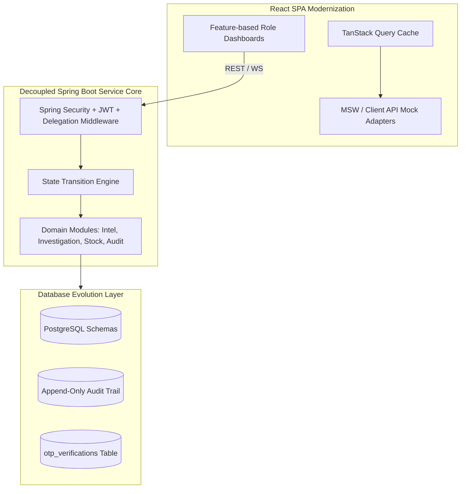
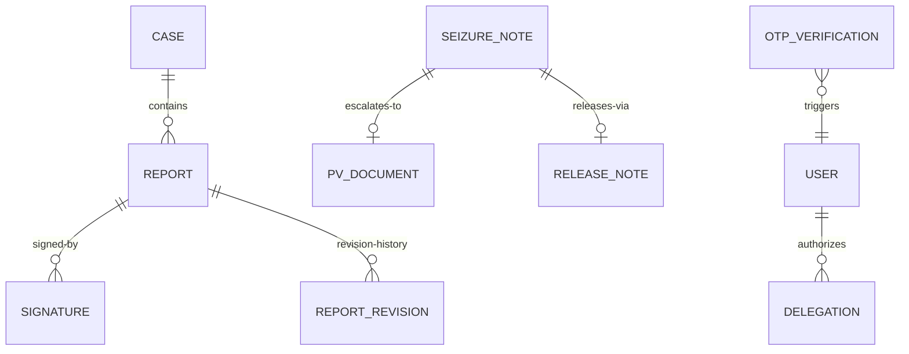

# SIIDS Enterprise Modernization & Strategic Transformation Blueprint
** Rwanda Revenue Authority (RRA) · Intelligence & Enforcement Division **

---

## 1. Executive Modernization Summary

The Strategic Intelligence & Investigation Division System (SIIDS) is entering a strategic transformation phase. This document serves as the architectural blueprint for migrating the platform from its basic, highly coupled prototype state to an enterprise-grade, secure, and horizontally scalable system.

### Current Core Deficiencies:
1. **Security Vulnerabilities**: Missing endpoint auth guards on critical stock APIs, hardcoded encryption secrets, and a lack of audit visibility.
2. **Coupled Workflows**: State transitions are managed using hardcoded string switches inside massive "god services", leading to rigid flows and high risk of deadlocks.
3. **UX & UI Limitations**: Fragmented page routing, commented-out sidebar sections, manual data entry for duplicate records, and client-side processing of large datasets.
4. **Brittle Integration**: Hardcoded DB record IDs in repositories, conflicting Axios API clients, and the absence of a unified error/validation framework.

### The Modernization Strategy:
To address these issues, we will separate concerns and proceed with a phased approach:
* **Phase 1**: Strategically redesign the system contracts.
* **Phase 2**: Rebuild the React user interface (`frontendV2`) using mock APIs that mirror future backend contracts.
* **Phase 3**: Refactor and modernize the Spring Boot backend services, decoupling domains and standardizing REST/WebSocket APIs.
* **Phase 4**: Integrate the modernized frontend and backend.

---

## 2. Stakeholder Requirement Mapping

This section maps RRA stakeholder demands (from the Change Log documents) directly to their affected architectural layers and implementation targets.

### 2.1. Intelligence & Investigation Changes
```text
┌──────────────────────────────────────┬────────────────────────┬────────────────────────────────────────────┐
│ Requirement Description              │ Layer(s) Affected      │ Technical Target                           │
├──────────────────────────────────────┼────────────────────────┼────────────────────────────────────────────┤
│ AC Error handling & friendly message │ Frontend + Backend     │ Global Exception Handler + API error shape │
│ Dual Signatures (AC + Director Intel)│ Frontend + Backend + DB│ New `signatures` table & lock state logic  │
│ Redesigned Report PDF Template       │ Frontend + Backend     │ Thymeleaf / OpenHTMLtoPDF layout updates   │
│ Preserve Original Attachment Names   │ Backend + Database     │ Sanitized filename storage & download header│
│ Case Routing Modal & Multi-Dest      │ Frontend + Backend + DB│ `routed_to` ENUM, case routing controller  │
│ Director Edit & Sign Report          │ Frontend + Backend + DB│ `report_revisions` JSONB table, lock on sign│
│ Auto-Generated Final report from data│ Frontend + Backend + DB│ IO document compiler endpoint              │
└──────────────────────────────────────┴────────────────────────┴────────────────────────────────────────────┘
```

### 2.2. Stock Operations Changes
```text
┌──────────────────────────────────────┬────────────────────────┬────────────────────────────────────────────┐
│ Requirement Description              │ Layer(s) Affected      │ Technical Target                           │
├──────────────────────────────────────┼────────────────────────┼────────────────────────────────────────────┤
│ Seizure Reason Dropdown Additions    │ Frontend + Database    │ Seizure reason enum extension              │
│ Days in Stock Color Warning Alerts   │ Frontend + Backend     │ Date arithmetic update, vehicle gray-list  │
│ Seizure OTP Owner Confirmation       │ Frontend + Backend + DB│ Secured OTP engine, `otp_verifications`    │
│ Digital Template vs Scanned Upload   │ Frontend + Backend + DB│ Multipart parser, upload location config   │
│ Dynamic Return-to-Owner Form & Meta  │ Frontend + Backend + DB│ Correction audit schema, meta JSONB column │
│ PRSO Summary Landing Page            │ Frontend               │ Metrics API, Recharts integration          │
│ New Role: Deputy PRSO                │ All Layers             │ User Role Enum, guards, new dashboard views│
│ PRSO Delegated Release Approvals     │ Frontend + Backend + DB│ `delegations` schema, routing middleware   │
└──────────────────────────────────────┴────────────────────────┴────────────────────────────────────────────┘
```

---

## 3. Current vs Future System Vision

```text
┌──────────────────────────────┬────────────────────────────────────────────────────────┬───────────────────────────────────────────────────────────┐
│ System Area                  │ Current System State (Basic)                           │ Target Modernized State (Enterprise-Grade)                │
├──────────────────────────────┼────────────────────────────────────────────────────────┼───────────────────────────────────────────────────────────┤
│ Architecture                 │ Monolithic backend services; highly coupled domains.  │ Modular, Domain-Driven, Ports & Adapters architecture.    │
│ Workflows                    │ Procedural code switch blocks managing case statuses.  │ State Machine Engine tracking transitions in audit tables.│
│ User Experience (UX)         │ Flat lists, commented navigations, plain-text boxes.   │ Role-based dashboard widgets, steppers, and workspaces.   │
│ Security & Auditing          │ Bypassed stock APIs, plain-text signature strings.     │ Standard RBAC guards, hashed OTPs, digital signatures.    │
│ Reporting & Analytics        │ Client-side data aggregation and list exports.         │ Server-side compiled PDFs, Recharts metrics dashboards.   │
│ Database                     │ Sparse Tables, hardcoded lookup ID queries.            │ Normalised schemas, index-optimized columns, JSONB meta.  │
└──────────────────────────────┴────────────────────────────────────────────────────────┴───────────────────────────────────────────────────────────┘
```

---

## 4. Enterprise Modernization Strategy



---

## 5. FrontendV2 Strategic Blueprint

### 5.1. Feature-Based Architecture
We will migrate `frontendV2` from the current flat component folder to a modular, feature-based directory structure:

```text
siidsfrontend/
├── src/
│   ├── assets/             # Brand logos, themes, and global static assets
│   ├── components/         # Global shared UI elements (Button, Table, Card, Dialog)
│   ├── context/            # AuthContext, UIContext (Global layouts & theme state)
│   ├── features/           # Domain-specific logic, components, and hooks
│   │   ├── intelligence/   # IO and Director of Intelligence components
│   │   ├── investigation/  # Case plans, findings, and IO final reports
│   │   ├── stock/          # Seizures, temporary/main stock, releases, and OTP forms
│   │   └── admin/          # User registration and role configurations
│   ├── hooks/              # Global reusable hooks (useAuth, useNotification)
│   ├── services/           # Unified ApiClient wrapper
│   └── App.jsx             # React Router v7 root routes
```

### 5.2. Modular Components & State Isolation
* **TanStack Query (React Query)**: Replaces local state caches. Fetching case listings is managed via Query hooks, auto-invalidating when actions (like sign or route) complete.
* **Component Extraction**: Extract the massive dashboards (e.g., `IntelligenceOfficer.jsx`) into smaller, modular views:
  - `SeizureNoteWizard.jsx`: Multi-step form tracking Digital vs. Scanned mode.
  - `SignaturePanel.jsx`: Shared panel showing signed vs. pending roles.
  - `ReportsVisualiser.jsx`: Shared dashboard widget mapping metrics using Recharts.

### 5.3. Mock API Strategy for FrontendV2
To support decoupled development, the frontend will integrate Mock Service Workers (MSW) or a mock API layer:
* **Token Mocking**: Simulate JWT login exchanges and record mock roles (`DEPUTY_PRSO`, `SURVEILLANCE_OFFICER`, `PRSO`).
* **Workflow Simulation**: Simulate step-by-step state changes (e.g., advancing a report to `PENDING_DIRECTOR_SIGNATURE` status upon AC sign action).
* **WS Notification Mocking**: Simulate real-time Stomp updates pushing to the notification bell when items change.

---

## 6. Backend Refactor Strategic Blueprint

### 6.1. Domain Decomposition
Deconstruct the monolithic `ReportService` and `PhysicalStockService` into four decoupled domain modules:

```text
org.example.siidsbackend/
├── domains/
│   ├── auth/            # JWT validation, user accounts, and token refresh
│   ├── case/            # Case routing, registry, and tin assignments
│   ├── intelligence/    # Intelligence reports, signatures, and PDF layout compilation
│   ├── investigation/   # Case plans, findings upload, and auto-generated final reports
│   ├── stock/           # Seizures, temporary stock calculations, and releases
│   └── notification/    # WebSocket configs, STOMP brokers, and notification delivery
```

### 6.2. Decoupled Workflow & State Management
Move away from switch-case status modifications. Implement the State Pattern or Spring Application Events:
* Transition changes are driven by transition events: `SubmitReportEvent`, `SignReportEvent`, `RouteCaseEvent`.
* Event listeners process side-effects asynchronously: creating notifications, auditing actions, and generating PDF snapshots.

---

## 7. Database Evolution Blueprint

### 7.1. Normalisation & Structural decapsulation
We will normalize the schema to support clean domain boundaries and historic accuracy:



* **`signatures` Table [NEW]**:
  - Columns: `id (PK)`, `report_id (FK)`, `signed_by_id (FK)`, `role (ENUM: AC, DIRECTOR_OF_INTELLIGENCE)`, `signed_at`.
* **`report_revisions` Table [NEW]**:
  - Columns: `id (PK)`, `report_id (FK)`, `revised_by_id (FK)`, `revision_content (JSONB)`, `revised_at`.
* **`delegations` Table [NEW]**:
  - Columns: `id (PK)`, `grantor_id (FK)`, `grantee_id (FK)`, `permission (ENUM: RELEASE_APPROVAL)`, `granted_at`, `revoked_at (Nullable)`.
* **`otp_verifications` Table [NEW]**:
  - Columns: `id (PK)`, `phone_number`, `otp_hash (SHA-256)`, `expires_at`, `verified_at (Nullable)`, `context (ENUM: SEIZURE_OWNER, OWNER_RETURN, AUCTION_HANDOVER)`.

### 7.2. Document Snapshots & JSONB Metadata
* **Document Snapshots**: Generated PDF snapshots will store a static copy of details (goods description, owner details, officer details) directly in the database as an immutable text snapshot. This prevents data drift if underlying database records are updated.
* **JSONB Columns**: Use PostgreSQL JSONB to store dynamic data like dynamic return reason checklist payloads:
  - Column: `reason_metadata` in return log tables.

---

## 8. Workflow Transformation Blueprint

### 8.1. Seizure Note Creation & OTP Verification
* **Current State**: Surveillance Officer types details and signs using local password check.
* **Pain Points**: No validation of owner identity or acknowledgement of seized goods.
* **Modernized Flow**:
  1. Officer initiates seizure. Chooses between **Digital Form** or **Physical Scan Mode** (attaches physical document scan).
  2. If the owner is known, the system triggers `POST /api/otp/send` with context `SEIZURE_OWNER`.
  3. Owner receives SMS OTP. Officer inputs OTP into the wizard to confirm owner acknowledgement.
  4. If the owner is unknown, officer toggles "Owner Unknown", skipping OTP verification. The skip is audited.

### 8.2. Return-to-Owner & OTP Release
* **Current State**: Officer changes state to `RELEASED` in temporary stock.
* **Pain Points**: No receipt confirmation; return history is not audited.
* **Modernized Flow**:
  1. Surveillance Officer creates a return request and inputs fines/penalties amounts in RWF.
  2. System sends an OTP to the owner (`context=OWNER_RETURN`).
  3. Owner confirms receipt via OTP.
  4. System generates an immutable Release Note PDF with the final RWF details, and writes the action to the audit log.

### 8.3. PRSO Release Delegation
* **Current State**: Only the PRSO can approve stock release requests.
* **Pain Points**: Creates approval bottlenecks when the PRSO is offline.
* **Modernized Flow**:
  1. PRSO toggles delegation on their dashboard settings.
  2. Delegation record is created in the `delegations` table, authorizing the Deputy PRSO.
  3. System middleware intercepts release request routes. If delegation is active, notifications and approval actions are dynamically routed to the Deputy PRSO's queue.
  4. PRSO can revoke the delegation at any time.

---

## 9. Security Modernization Blueprint

### 9.1. Unified Authorization & Role Guards
* **Endpoint Protection**: Re-enable authentication on `/api/stock/**`. Block access using role annotations:
  - `@PreAuthorize("hasAnyAuthority('PRSO', 'DEPUTY_PRSO')")` on release approvals.
  - `@PreAuthorize("hasAnyAuthority('Surveillance', 'SURVEILLANCE_OFFICER')")` on temporary stock entry.
* **Delegation-Aware Security**: Middleware checks authorization rules. A Deputy PRSO can only call `/api/stock/goods/{id}/approve-release` if an active delegation record exists in the database.

### 9.2. Audit Logs & Signature Locking
* **Immutable Logs**: The `audit_log` table will be set to write-only permissions for the application user (no UPDATE or DELETE privileges allowed).
* **Double Signature Lock**: Once both required signatures (AC and Director of Intelligence) are present in the `signatures` table:
  - Any edit requests (`PUT /api/reports/{id}/edit`) will immediately return `403 Forbidden`.

---

## 10. Dashboard Evolution Blueprint

### 10.1. Director of Intelligence Dashboard
* **Current Limitations**: Chronological lists with no category separation or search filters.
* **Target Vision**: A tabbed workspace dashboard.
* **Enterprise Widgets**:
  - **Metrics summary cards**: showing Pending Reviews, Auto-Generated Reports, and Signed Reports.
  - **Generated Reports Column**: distinct tab displaying reports compiled automatically by the system (`generation_type = AUTO_GENERATED`).
* **Workflow Shortcuts**: Quick-view splits and a single-click "Modify and Sign" editor.

### 10.2. Assistant Commissioner Dashboard
* **Current Limitations**: Raw tabular lists of cases and reports.
* **Target Vision**: High-level executive review dashboard.
* **Enterprise Widgets**:
  - **Financial Summary Cards**: tracking fines and penalties collected in RWF.
  - **Routing Modal**: Multi-destination routing selector (routes approved cases to DOI, Prosecution, Enforcement, etc.).

### 10.3. Deputy PRSO Dashboard (New Role)
* **Target Vision**: A queue-based action center dashboard.
* **Enterprise Widgets**:
  - **Returned Goods Queue**: lists items in status `RETURNED` with dynamic detail view panels.
  - **Exception Case Stepper**: tracks appeal cases in status `EXCEPTION` with fields for reduced fines and special conditions.

---

## 11. API Modernization Blueprint

### 11.1. Standardised REST Contracts
All responses will follow a unified API envelope structure:

```json
{
  "success": true,
  "timestamp": "2026-05-28T21:55:00Z",
  "data": {},
  "error": null
}
```

If an endpoint fails, a structured error format will be returned:

```json
{
  "success": false,
  "timestamp": "2026-05-28T21:55:00Z",
  "data": null,
  "error": {
    "code": "AC_INTEGRATION_ERROR",
    "message": "Failed to connect to the Assistant Commissioner routing service.",
    "details": ["Connection timeout after 3000ms"]
  }
}
```

### 11.2. REST Resource Uniformity
* Remove URI substring parsing. Replace with clean path variables:
  `GET /api/v1/cases/{caseNum}` instead of custom string parsing.
* Implement server-side pagination query conventions:
  `GET /api/v1/stock/goods?page=0&size=10&sortBy=pvNumber&order=desc`

---

## 12. UI/UX Modernization Blueprint

### 12.1. Navigation Redesign
* **Menu Sections**: Reorganise the side drawer navigation to restore the **Intelligence** section, separating it cleanly from the **Surveillance** section.
* **Theme Styling**: Standardize colors to align with official RRA branding, utilizing a premium dark/light mode palette:

```css
:root {
  --primary-brand: #0D47A1;      /* Deep RRA Blue */
  --primary-accent: #1565C0;     /* Light Slate Blue */
  --accent-gold: #FFB300;        /* Gold warning highlights */
  --background-neutral: #F5F7FA; /* Soft light grey background */
  --alert-green: #2E7D32;
  --alert-violet: #8E24AA;
}
```

### 12.2. User Interface Patterns
* **Visual Timelines**: Display progress bars showing the stages of a case (e.g., Seizure -> Temporary Stock -> Escalated -> Main Stock -> Pending Release -> Released).
* **Workspaces**: Implement side-pane document previews alongside tables so users do not have to leave the page to read reports.

---

## 13. Technical Debt & Risk Report

* **Debt 1: Security Bypass**: The `permitAll()` bypass on `/api/stock/**` exposes critical inventory endpoints. This must be corrected in Sprint 1.
* **Debt 2: Hardcoded Query Identifiers**: The native database queries in `ReportRepo` hardcode database primary keys, making deployment to other environments fragile.
* **Debt 3: Overloaded JPA Entities**: `Report.java` acts as a god entity, combining multiple lifecycle phases and lacking an independent status field.
* **Debt 4: BaseURL Conflicts**: The frontend declares conflicting backend URLs (ports `8080` vs `2005`), causing API errors in local development.

---

## 14. Prioritized Transformation Roadmap

```text
Transformation Roadmap Sprints:
┌──────────────────────────────┬────────────────────────────────────────────────────────┬─────────────┐
│ Sprint Phase                 │ Core Objective                                         │ Timeline    │
├──────────────────────────────┼────────────────────────────────────────────────────────┼─────────────┤
│ Sprint 1: Security & Setup   │ Fix Stock API bypasses, JWT keys, and hardcoded SQL IDs│ Weeks 1 - 2 │
│ Sprint 2: Core FrontendV2    │ Rebuild feature directory layout and mock API layer.   │ Weeks 3 - 4 │
│ Sprint 3: Service Split      │ Deconstruct ReportService and split the Report entity. │ Weeks 5 - 6 │
│ Sprint 4: Unified Interfaces │ Integrate new OTP verification and delegation routes.  │ Weeks 7 - 8 │
└──────────────────────────────┴────────────────────────────────────────────────────────┴─────────────┘
```

---

## 15. Recommended Implementation Phases

### Phase 1: Architectural Foundation (Sprints 1-2)
* Restructure database schemas using migration tools.
* Unify frontend Axios clients and API configurations.
* Implement MSW mock endpoints in `frontendV2`.

### Phase 2: Feature Rebuild (Sprints 2-3)
* Rebuild dashboards for roles, adding search filters and Recharts metrics.
* Implement the new Deputy PRSO role and dashboard view.
* Create the multi-step Seizure Note and Return-to-Owner OTP forms.

### Phase 3: Domain Separation (Sprints 3-4)
* Split the monolithic backend classes into separate domain services.
* Decouple report status tracking from cases by adding an independent report status field.
* Standardize API response wrappers and implement a global exception handler.

### Phase 4: Integration & Hardening (Sprint 4+)
* Replace the mock API adapters with live backend routes.
* Perform verification testing on role guards, dual-signature locks, and OTP verification flows.
