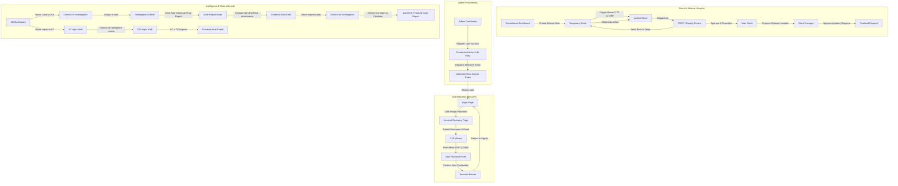

# SIIDS FrontendV2 Enterprise Testing & Verification Guide

This document serves as the official testing and verification guide for the scaffolded **SIIDS FrontendV2 Command Center**. It covers the complete operational flow across all 8 organizational roles, authentication recovery (Forgot Password + OTP Verification), and visual workflow architecture diagrams.

---

## 1. Mock Test Credentials

For development and offline testing, the system runs with **Mock Service Worker (MSW)** enabled, which intercepts all `/api/v1` traffic. Security checks are mocked in the frontend to route based on matching substrings in the username.

> [!NOTE]
> For offline mock verification, **any password** will be accepted by the mock login interceptor. The roles are dispatched using the username mappings below.

| Role Group | Test Username | Test Password | Mock User Name | Target Route | Operational Context |
| :--- | :--- | :--- | :--- | :--- | :--- |
| **System Administrator** | `admin` | *(any)* | System Administrator | `/admin` | User accounts list, registration, role edit, toggle deactivation |
| **Surveillance Officer** | `officer` | *(any)* | Olivier Nsengimana | `/surveillance` | Seizure entries, owner OTP registration |
| **Stock Manager** | `manager` | *(any)* | Claver Gatete | `/stock-manager` | Main stock, disposal release proposals |
| **Deputy PRSO** | `deputy` | *(any)* | Fidelis Karangwa | `/prso` | Temporary stock reviews, send-backs |
| **PRSO** | `prso` | *(any)* | Richard Tusabe | `/prso` | Delegation settings, stock oversight |
| **Intelligence Officer** | `intel` | *(any)* | Eric Gatera | `/intelligence-officer` | Create findings reports, revise returned drafts |
| **Assistant Commissioner** | `ac` | *(any)* | Ronald Niwenshuti | `/ac` | Case file routing, report co-signing |
| **Director of Intelligence** | `director` | *(any)* | Christian Mugunga | `/doi` | Draft report revisions, final approval |
| **Director of Investigation** | `inv-director` | *(any)* | Director Jean de Dieu | `/investigation-director` | Case assignment, final report approval |
| **Investigation Officer** | `inv-officer` | *(any)* | Officer Alphonse | `/investigation-officer` | Review assigned cases, report auto-gen |

---

## 2. System Flow Architecture

The diagram below visualizes the user authentication recovery process and the main operational lifecycles, showing how the **Investigation Director** and **Investigation Officer** connect strategically downstream of the AC's case routing actions.

---

## 3. Step-by-Step E2E Testing Instructions

### Flow A: Account Recovery & Password Reset

Ensure that the recovery wizard behaves predictably when updating credentials.

1. Navigate to the main login portal (`/login`).
2. Click **Forgot Password?** located on the top right of the password label row.
3. You will be redirected to the **Account Security Recovery Hub** (`/forgot-password`).
4. **Step 1:** Enter any username (e.g. `officer`) and email (e.g. `officer@rra.gov.rw`) and click **Request Password Reset**.
5. **Step 2:** The OTP Wizard will load. Input the master testing verification code **`123456`** and click **Verify Code**.
6. **Step 3:** Enter `newpassword123` in both the **New Password** and **Confirm Password** fields, then click **Save New Password**.
7. **Step 4:** Verify that the success badge is displayed, click **Return to Sign In**, and log in with your updated credentials.

---

### Flow B: Surveillance & Temporary Stock Entry

Test the ingress of seized items into temporary storage.

1. Sign in with the username **`officer`**.
2. Observe the **Inline Dual-Column Split Workspace**:
   - The **Left Column** lists active temporary stock records (e.g. Toyota Hilux 2018).
   - The **Right Column** displays the action panel, featuring the **Create Seizure Note** form.
3. Fill out the **Create Seizure Note** form (e.g. "Electronic Components cargo", Seizure Type: `ELECTRONICS`, Location: `Gikondo Warehouse`, Owner: "Jean Bosco", Phone: `+250788999999`).
4. Submit the form. Verify that the new item instantly appears in the temporary stock list.
5. Select the newly created item. The action pane will show the **Owner Receipt Verification (OTP)** wizard.
6. Submit the verification OTP using code **`123456`**. Verify the status transitions to **MAIN_STOCK** once authenticated.

---

### Flow C: Stock Manager & Release Proposals

Test inventory migration to main stock and disposal routing.

1. Sign in with the username **`manager`**.
2. The dashboard displays key metrics cards (Fines Collected, Auction Revenue, Stock Count) and the current inventory list.
3. Select an item with the status `MAIN_STOCK` from the list.
4. The right-hand column will render the **Propose Stock Disposal / Release** form.
5. Enter disposal details:
   - **Release Mechanism:** `AUCTION`
   - **Auction Revenue Estimate (RWF):** `2500000`
   - **Proposed Auction Date:** Select any future date.
   - **Target Recycler Category:** Select an appropriate category.
   - **Notes:** Add comments (e.g., "Ready for public auction").
6. Click **Propose Release**. Verify that the item's status transitions to `RELEASE_REQUEST_PENDING` and that the metrics update immediately.

---

### Flow D: PRSO & Deputy Delegation Controls

Test the oversight of temporary stock and authorization delegation settings.

1. Sign in with the username **`prso`**.
2. Observe the PRSO workspace showing temporary stock reviews and the **Authorization Delegation Settings** panel in the split screen.
3. In the delegation pane, fill in the fields to delegate authority:
   - **Grantee Employee ID:** `deputy`
   - **Grantee Name:** `Fidelis Karangwa`
   - **Delegation Scope:** `TEMPORARY_STOCK_REVIEWS`
4. Click **Delegate Authority**. Verify that the delegation history updates dynamically.
5. Log out and sign in as **`deputy`**.
6. Select any pending temporary stock item.
7. Perform a **Send-Back / Correction Request**: Input a reason in the field (e.g., "Missing certificate documents") and click **Send Back to Surveillance**. Verify that the item is returned to the surveillance officer for corrections.

---

### Flow E: Intelligence Officer Report Submission & Corrections

Test the draft creation, submission, and returned revision workflows.

1. Sign in with the username **`intel`**.
2. Observe the **Intelligence Officer Dashboard** showing metrics and assigned case files.
3. Select an assigned case (e.g. `RRA-INTEL-2026-0041`).
4. In the right panel, observe the **Intelligence Document Workspace** form.
5. Fill out the report creation details:
   - **Report Title:** `Illegal Cross-Border Electronic Cargo Influx`
   - **Subject:** `Semiconductor chips bypass custom scanners at Rubavu border`
   - **Findings and Legal Basis:** Input some findings text.
6. Click **Submit Report to AC & Director**. Verify the case status transitions to `REPORT_SUBMITTED`.
7. *Simulated Correction:* If a case status becomes `REPORT_RETURNED_TO_INTELLIGENCE_OFFICER`, select it to view the **Correction Request Notes** (return reasons), revise the form, and re-submit.

---

### Flow F: Assistant Commissioner (AC) Case Routing

Test case routing and report validation.

1. Sign in with the username **`ac`**.
2. The AC dashboard displays **Active Intelligence Cases** and **Pending Reports**.
3. Select a case from the list (e.g. "Cross-Border Electronics Infraction").
4. In the right-hand column, use the routing form to assign it:
   - **Target Department / Destination:** Select `Director of Investigation` (this sets `routedTo` value to `DOI`).
5. Click **Route Case File**. Confirm that the case status updates to `ROUTED`.

---

### Flow G: Director of Investigation Assignment

Test receiving routed cases and staff dispatching.

1. Sign in with the username **`inv-director`**.
2. Observe the **Director of Investigation Console** showing key workload stats.
3. In the list, click on the routed case (e.g. `RRA-INTEL-2026-0041`).
4. In the right panel, observe the **Assign to Investigation Officer** form.
5. Select `Investigation Officer Alphonse (inv-officer)` and click **Confirm Officer Assignment**.
6. Confirm the case assignment updates status to `REPORT_ASSIGNED_TO_INVESTIGATION_OFFICER` and list shows the assignment metadata.

---

### Flow H: Investigation Officer Auto-Generation

Test case ingestion, evidence limitations, and drafting.

1. Sign in with the username **`inv-officer`**.
2. Observe the **Investigation Officer Workspace** listing cases assigned to you.
3. Select the case (e.g., `RRA-INTEL-2026-0041`).
4. Read the **Evidence-Only Attachments Enforced** warnings clarifying that non-evidence files are restricted.
5. Click **Auto-Generate Final Report from Case Data**.
6. A drafting dialog will appear pre-populated with:
   - **Summary** (pulled from case notes)
   - **Findings** (pulled from border intelligence reports)
   - **Conclusion**
7. Perform a minor edit to the text body and click **Submit Report for Approval**. Verify the report transitions status.

---

### Flow I: Director of Investigation Report Sign-Off

Test the final case lock-out.

1. Sign in with the username **`inv-director`**.
2. Click the **Final Reports** tab.
3. Select the newly submitted investigation report from the list.
4. Preview the document in the **Intelligence PDF Previewer** window.
5. Click **Sign & Finalise Investigation Report**.
6. The report status updates to **FINALISED** and co-signing indicators show both Officer and Director validation stamps.

---

### Flow J: System Administrator Dashboard & Accounts Control

Test user account provisioning, activation status toggles, and role assignments.

1. Sign in with the username **`admin`**.
2. Observe the **Inline Dual-Column Split Workspace**:
   - The **Left Column** lists active system personnel accounts (including ID, Employee ID/Username, Assigned Role, Status).
   - The **Right Column** displays the action panel, pre-loaded with the **Register New User Account** form.
3. In the Left Column, select any existing user account (e.g. `intel`).
4. The right column will switch to the **Account Controls Pane**:
   - Verify it displays the User ID, Employee ID, Current Role, and Status.
   - Click **Change User Role** to open the inline role assignment form. Select a different role (e.g. `SURVEILLANCE_OFFICER`) and click **Update Role**. Check that the role updates instantly in the list.
   - Click **Deactivate Account** (or **Activate Account** if it was disabled). Verify that the status badge updates instantly from `Active` to `Disabled` (or vice versa).
5. Deselect the user by clicking the **X** on the Account Controls Pane header to return to the registration pane.
6. Fill out the **Register New User Account** form:
   - **Employee ID / Username:** `newuser`
   - **Assigned Operational Role:** Select any role (e.g. `STOCK_MANAGER`).
7. Click **Register User Account**. Verify that the success banner displays ("User account successfully registered. Welcome invitation dispatched.") and that `newuser` appears immediately in the Left Column accounts list.
8. Log out and try signing in as **`newuser`** (with any password). Confirm that the system automatically routes the new account to `/stock-manager`!

---

## 4. Expected Page Layouts and UX Architecture

To maintain a consistent and premium look, verify the following design elements on all screens:

*   **Header Navigation:** The persistent top bar must show the authenticated user's name, role badge, department, a real-time notification bell (with dynamic badge counts), and a log out button.
*   **Dual-Column Workspace:** The split-screen layout must display list elements in the left panel and detailed views, actions, or forms in the right panel to minimize navigation fatigue.
*   **Theme and Palette:** The interface features the official RRA Royal Blue (`#003DA5`), gold accents (`#F5A800`), clean borders (`1px solid rgba(226,232,240,0.8)`), and subtle glassmorphism layouts.
*   **Typography:** Displays typography using the official RRA web portal font-family (`Open Sans` and `Outfit`) for standard corporate look-and-feel.
*   **Command Palette:** Pressing `Ctrl + K` anywhere in the app should toggle the operational search menu.
